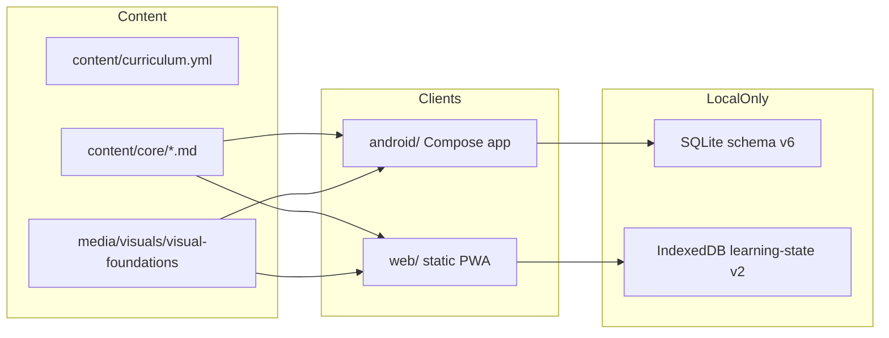

# AetherLearn knowledge graph

**Read this first in a new session.** Then `docs/TODO.md` (first unchecked item) and `git log -5`. Do not rescan the whole repository unless this file is stale relative to `main`.

Repo: [Sudipsudip5250/aetherlearn-mvp-spec](https://github.com/Sudipsudip5250/aetherlearn-mvp-spec) · License MIT · working name **AetherLearn**.

## Pointer (update every session)

| Field | Value |
|---|---|
| Last graph update | 2026-09-12 |
| `main` at last update | `52e8789` (merge of PR #5) plus in-flight brand/icons PR on `feat/brand-icons-and-knowledge-graph` |
| Last merged product PR | [#5](https://github.com/Sudipsudip5250/aetherlearn-mvp-spec/pull/5) — debug APK path, reading themes, Settings groups, local dashboard/goals |
| Tester APK | [debug-58ecbce](https://github.com/Sudipsudip5250/aetherlearn-mvp-spec/releases/tag/debug-58ecbce) · file `AetherLearn-debug.apk` · debug-signed, not production |
| Next agent work after this file lands | Merge brand/icons PR if green; then stop for human phone testing unless a validator is red |
| Do not do | Stage 6 tracks, accounts, analytics, cloud sync, signing keys, claiming device/TalkBack pass |

## Invariants (never change without a decision-log entry)

- Privacy-first, local-first. No login, ads, analytics, or remote learner dashboard.
- Android (Kotlin + Compose + Material 3) is primary. Web/PWA is secondary.
- Lesson IDs and learner-state keys stay stable. Schema migrations must be additive.
- Termux is optional, allowlisted, never required.
- Security content is S0/S1 defensive only.
- Core catalog is 37 bundled lessons (frozen `mvp-20` + Stages 1–5). No Stage 6.

## Architecture



Parity: `scripts/check_android_content.py` and `scripts/check_web_content.py` keep lesson bytes in sync. Touching `content/core/` means both payloads.

## Code map

| Job | Where |
|---|---|
| Navigation / first-run | `android/.../MainActivity.kt` |
| Learn / Practice / Search / Progress | `LearnScreen.kt`, `PracticeScreen.kt`, `SearchScreen.kt`, `ProgressScreen.kt` |
| Lesson reader + diagrams | `LessonReaderScreen.kt` |
| Appearance, packs, export | `SettingsScreen.kt`, `ui/theme/Theme.kt` |
| Local store / goals / theme keys | `data/LocalStore.kt` (`theme_mode`, `reading_theme`, `learning_goals`) |
| Packs / HTTPS ZIP | `PackManager.kt`, `NetworkPackInstaller.kt` |
| Termux allowlist | `TermuxWrappers.kt`, `docs/TERMUX_WRAPPERS.md` |
| Web shell | `web/index.html`, `web/app.js`, `web/styles.css`, `web/sw.js` |
| Web state | `web/idb.js` — progress/notes/bookmarks/quiz/goals |
| Brand icons | `web/favicon.svg`, `web/icons/`, `web/og.jpg`, `android/app/src/main/res/mipmap-*` |
| Debug APK publish | `.github/workflows/publish-debug-apk.yml` |
| Quality CI | `.github/workflows/quality.yml` |

## Local reading themes

Android `ReadingTheme`: `DEFAULT`, `WARM_PAPER`, `COOL`, `HIGH_CONTRAST`, `SOFT_PATTERN`.  
Web `data-reading`: `default` \| `warm` \| `cool` \| `high-contrast` \| `ambient`.  
Persisted locally only.

## Remaining work (ranked)

### Human-only (do not mark done)

1. Phone install of `AetherLearn-debug.apk` (checksum, unknown-sources, privacy screen).
2. Device matrix: navigation, offline lesson, persistence, TalkBack, large text, Termux paths.
3. Android-browser PWA smoke.
4. Pedagogical / safety / Stage 5 historical-career review.
5. Production signing + Play distribution (see `SIGNING.md`). Keystore never in git/CI.

### Agent-safe next (after icons PR)

1. If Quality is red on a PR, fix that first.
2. Small UX bugs found in scan (no new tracks).
3. Content clarity inside existing lessons only.
4. Keep TODO/PLAN/this graph aligned with `main`.
5. Stop and hand back for real phone testing.

## Session protocol

1. `git fetch && git log origin/main -5 --oneline && gh pr list`
2. Read **this file**, then first open `docs/TODO.md` section.
3. Do one coherent slice. Keep validators green.
4. Update the Pointer table here and TODO evidence.
5. Open or update a focused PR. Do not merge if checks are red.
6. Never claim device tests without evidence.

## Validators (repo root)

```text
python3 scripts/check_markdown_links.py
python3 scripts/check_web_content.py
python3 scripts/check_android_content.py
python3 scripts/check_android_manifest.py
python3 scripts/check_visual_pack_mirrors.py
python3 -m unittest discover -s tests -q
node --check web/app.js && node --check web/sw.js
```
